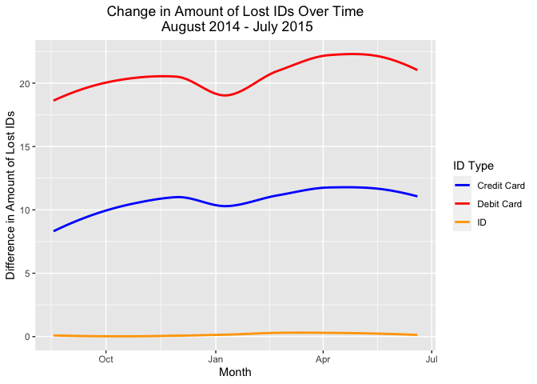

<!-- README.md is generated from README.Rmd. Please edit that file -->

# LostFound

<!-- badges: start -->

[](https://github.com/aboskovic21/LostFound/actions)
<!-- badges: end -->

The goal of LostFound is to provide a useful data set in R.

This data set comes from DataIsPlural available as a spreadsheet
[here.](https://docs.google.com/spreadsheets/d/1wZhPLMCHKJvwOkP4juclhjFgqIY8fQFMemwKL2c64vk/edit#gid=0)
It is from 12/30/2015, with the headline “Things lost (and not yet
found) on the New York subway.” This lists an a GitHub repository with
the dataset as well.

Fivethirtyeight has an interesting article with some interesting
findings about this dataset
[here.](https://fivethirtyeight.com/features/mta-new-york-lost-and-found-subway-most-common/)

## Installation

You can install the released version of LostFound from
[GitHub](https://github.com/) with:

``` r
# install.packages("devtools")
remotes::install_github("aboskovic21/LostFound")
```

## Example

This is a basic example: How do different forms of lost identification
on the NYC subway compare over time?

``` r
library(LostFound)
library(tidyverse)

data("LostFound")

lost_ids <- LostFound %>%
  mutate(
    id_change = id - lag(id),
    credit_change = credit_card - lag(credit_card),
    debit_change = debit_card - lag(debit_card)
  ) %>%
  select(date, id_change, credit_change, debit_change) %>%
  filter(date > "2014-08-17", date < "2015-07-06")

id_long <- gather(data = lost_ids, key = "change", value = "difference", -c("date"))

ggplot(id_long, aes(x = date, y = difference, color = change)) +
  geom_smooth(se = FALSE) +
  labs(
    x = "Month",
    y = "Difference in Amount of Lost IDs",
    title = "Change in Amount of Lost IDs Over Time\n August 2014 - July 2015",
    color = "ID Type"
  ) +
  scale_color_manual(
    labels = c("Credit Card", "Debit Card", "ID"),
    values = c("blue", "red", "orange")
  ) +
  theme(plot.title = element_text(hjust = 0.5))
```



The most frequent lost form of ID on the NYC Subway between August 2014
and July 2015 was debit card. There was a small decrease in change of
amount of lost IDs in January of 2015, which could maybe reflect that
fewer people were riding the Subway.
